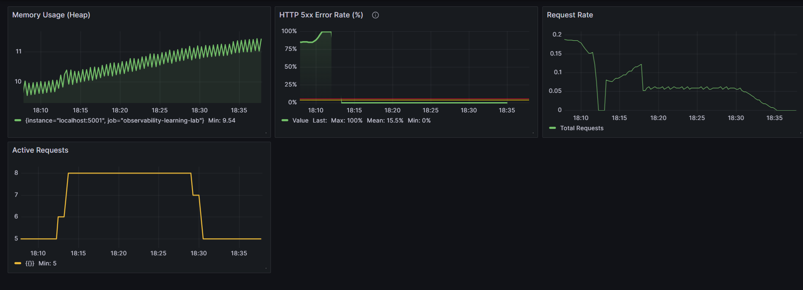
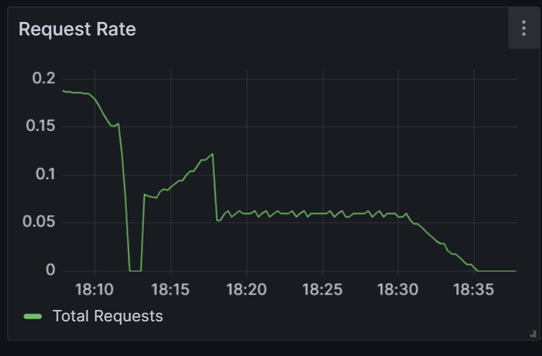
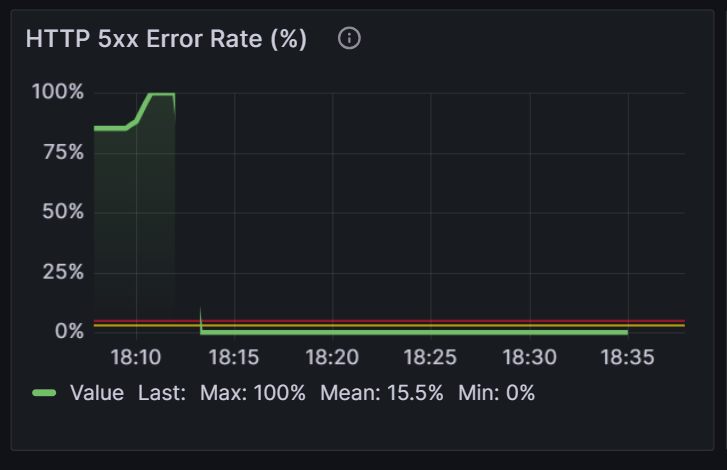
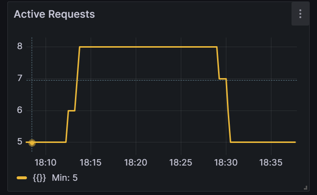
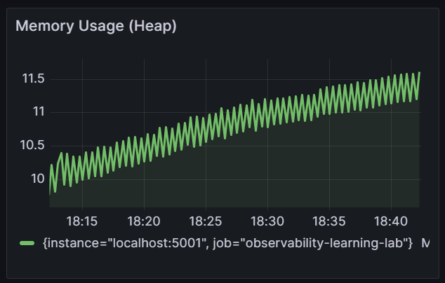

# Observability Learning Lab

A hands-on observability project built with **Node.js**, **Express.js**, **Prometheus**, and **Grafana** to explore modern application monitoring and metrics collection.

This project demonstrates how to instrument a Node.js application, expose application metrics, collect them using Prometheus, analyze them with PromQL, and visualize operational insights through production-inspired Grafana dashboards.

The implementation focuses on understanding the fundamentals of observability and building a strong foundation for larger monitoring systems such as **PulseOps**, an API Health Monitoring Platform.

---

# Features

- Prometheus integration
- Metrics endpoint (`/metrics`)
- Default Node.js runtime metrics
- Custom Counter, Gauge, and Histogram metrics
- PromQL querying
- Grafana dashboard development
- Production-inspired monitoring panels
- Documentation for every implementation phase

---

# Tech Stack

- Node.js
- Express.js
- Prometheus
- prom-client
- Grafana
- Git & GitHub

---

# Dashboard Overview

The Grafana dashboard provides operational visibility into the application's health through four monitoring panels.

## Full Dashboard



---

## Request Rate

**Purpose**

Monitor incoming HTTP traffic over time to understand application load.




---

## HTTP 5xx Error Rate

**Purpose**

Monitor the percentage of server-side errors.

Features:

- Visual threshold at **5%**
- Designed to quickly identify spikes in server failures
- Uses PromQL to calculate error percentage



---

## Active Requests

**Purpose**

Monitor the number of requests currently being processed by the application.

Features:

- Real-time concurrency tracking
- Custom Gauge metric




---

## Heap Memory Usage

**Purpose**

Monitor Node.js heap memory usage to observe application memory behavior.

Features:

- Uses default Node.js runtime metrics
- Displays heap usage in MiB



---

# Metrics Implemented

## Counter

### http_requests_total

Tracks the total number of HTTP requests received by the application.

Used for:

- Request counting
- Request rate calculations
- Error rate calculations

---

## Gauge

Implemented custom Gauge metrics.

### active_requests

Tracks the number of requests currently being processed.

Used for:

- Concurrent request monitoring
- Server load visualization

---

## Histogram

### http_request_duration_seconds

Measures request latency.

Used for:

- Response time analysis
- Latency distribution
- Performance monitoring

---

## Default Runtime Metrics

Collected automatically through **prom-client**.

Examples include:

- Heap memory usage
- Process memory
- Event loop statistics
- Garbage collection metrics
- CPU usage

---

# Labels & Time Series

Metrics are enriched using labels to create meaningful dimensions.

Implemented labels:

```text
method
route
status_code
```

These labels allow filtering and aggregation by:

- HTTP Method
- API Route
- HTTP Status Code

The project also explores why avoiding unnecessary high-cardinality labels is important for Prometheus performance.

---

# PromQL Examples

### Request Rate

```promql
sum(rate(http_requests_total[5m]))
```

---

### HTTP 5xx Error Rate

```promql
(
  sum(rate(http_requests_total{status_code=~"5.."}[5m]))
  /
  sum(rate(http_requests_total[5m]))
) * 100
```

---

### Active Requests

```promql
active_requests
```

---

### Heap Memory Usage

```promql
nodejs_heap_size_used_bytes / 1024 / 1024
```

---

# Dashboard Panels

The Grafana dashboard currently includes:

| Panel | Description |
|--------|-------------|
| Request Rate | Monitors incoming traffic over time |
| HTTP 5xx Error Rate | Displays the percentage of server-side failures |
| Active Requests | Tracks concurrent request processing |
| Heap Memory Usage | Monitors Node.js heap memory consumption |

Each panel is designed to answer an operational question rather than simply visualize raw metrics.

---

# Repository Structure

```text
observability-learning-lab/
│
├── docs/
│   ├── 01-prometheus-basics.md
│   ├── 02-counter.md
│   ├── 03-gauge.md
│   ├── 04-histogram.md
│   ├── 05-labels.md
│   └── 06-promql.md
│
├── monitoring/
│   └── prometheus.yml
│
├── screenshots/
│   ├── dashboard-overview.png
│   ├── panel-1-request-rate.png
│   ├── panel-2-5xx-error-rate.png
│   ├── panel-3-active-requests.png
│   └── panel-4-memory-usage.png
│
├── src/
│   ├── config/
│   │   └── metrics.js
│   │
│   ├── middleware/
│   │   └── metrics.middleware.js
│   │
│   ├── routes/
│   │   ├── index.routes.js
│   │   ├── metrics.routes.js
│   │   └── test.routes.js
│   │
│   ├── app.js
│   └── server.js
│
├── .gitignore
├── package.json
├── package-lock.json
└── README.md
```

---

# Project Progress

| Feature | Status |
|----------|--------|
| Express Application | ✅ Completed |
| Prometheus Integration | ✅ Completed |
| Metrics Endpoint | ✅ Completed |
| Counter Metrics | ✅ Completed |
| Gauge Metrics | ✅ Completed |
| Histogram Metrics | ✅ Completed |
| Labels & Time Series | ✅ Completed |
| PromQL Queries | ✅ Completed |
| Grafana Integration | ✅ Completed |
| Dashboard Development | ✅ Completed |
| Production Dashboard (4 Panels) | ✅ Completed |

---

# Concepts Learned

This project explores the core concepts behind modern application observability:

- Prometheus pull-based architecture
- Application instrumentation
- Counter, Gauge, and Histogram metrics
- Runtime metrics
- Labels and time-series design
- High-cardinality considerations
- PromQL querying
- Dashboard design principles
- Monitoring best practices

---

# Documentation

Each implementation phase is documented separately.

| File | Description |
|------|-------------|
| 01-prometheus-basics.md | Prometheus architecture and setup |
| 02-counter.md | Counter metrics |
| 03-gauge.md | Gauge metrics |
| 04-histogram.md | Histogram metrics |
| 05-labels.md | Labels and cardinality |
| 06-promql.md | PromQL fundamentals |

---

# Development Workflow

Each feature follows a practical engineering workflow:

1. Identify a monitoring requirement.
2. Select the appropriate metric type.
3. Instrument the application.
4. Verify metric exposure.
5. Configure Prometheus scraping.
6. Query metrics using PromQL.
7. Visualize operational insights with Grafana.

---

# Project Status

**Status:** ✅ Completed

### Completed

- Prometheus integration
- Metrics endpoint
- Application instrumentation
- Counter metrics
- Gauge metrics
- Histogram metrics
- Labels & time-series design
- PromQL queries
- Grafana dashboard with four operational panels
- Project documentation

---

# Future Improvements

Potential enhancements include:

- Grafana Alerting
- Alertmanager integration
- Notification channels (Email, Slack, Discord)
- Dashboard variables
- 95th percentile latency panel
- Node.js Event Loop Lag monitoring
- Multi-instance monitoring
- Docker Compose deployment
- Kubernetes deployment

---

# License

This project is licensed under the **MIT License**.